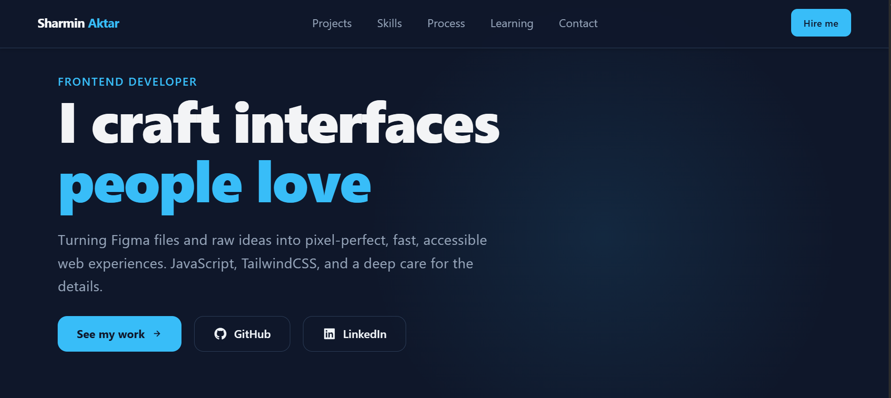
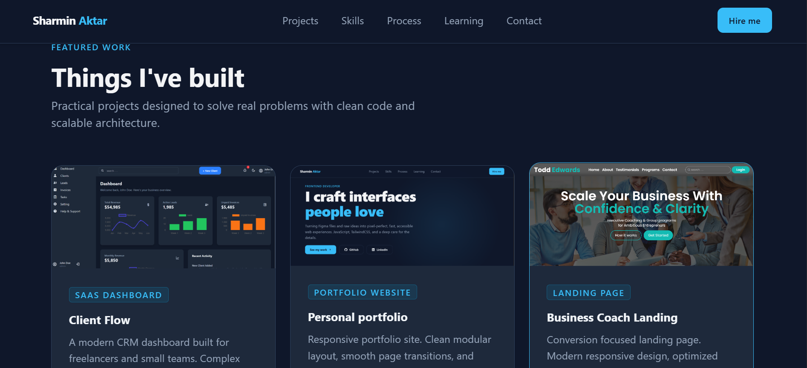
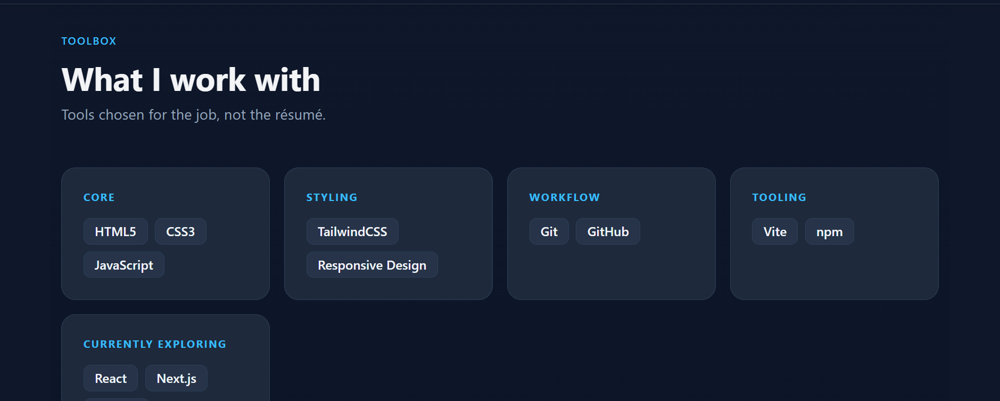
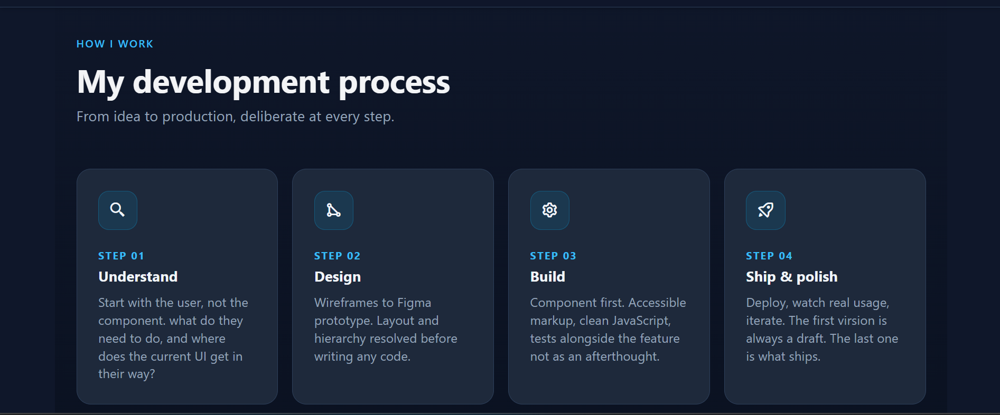
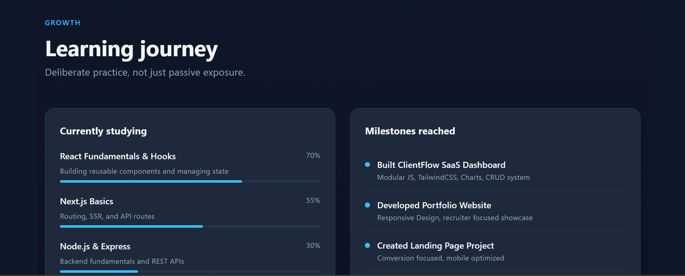
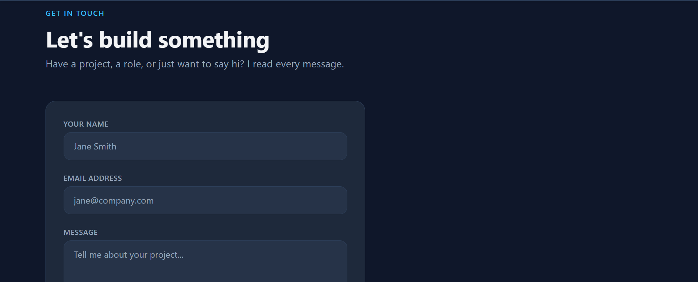

# Sharmin Aktar | Frontend Developer

A modern, responsive portfolio showcasing my projects, technical skills, and frontend development journey. Built with performance, accessiblity, and clean UI in mind.

**Live Demo:** [Live Demo](https://portfolio-eta-tawny-32.vercel.app/)

**Source Code:** https://github.com/webwizsharmin/portfolio

---

## Preview

### Home

### Projects

### Skills

### Process

### Learning Journey

### Conatact

---

## Tech Stack

- HTML5 -> Semantic stucture
- Tailwind CSS -> Styling
- JavaScript (ES6+) -> Application logic
- Vite -> Development & Build Tool
- Git -> Version Control
- GitHub -> Code Hosting
- Vercel -> Deployment

---

## Getting Started

git clone https://github.com/webwizsharmin/portfolio.git

cd portfolio

npm install

npm run dev

To build for production:

npm run build

---

## Featured Projects

- ClientFlow - Client Mangagment Dashboard
- Business Coach Landing
- Personal Portfolio
- EventFlow (coming soon)

---

## License

License under the MIT License.

---

## Connect

- **Portfolio:** [Live Demo](https://portfolio-eta-tawny-32.vercel.app/)
- **LinkedIn:** https://linkedin.com/in/webwizsharmin
- **GitHub:** https://github.com/webwizsharmin
- **Email:** webwizsharmin@gmail.com
